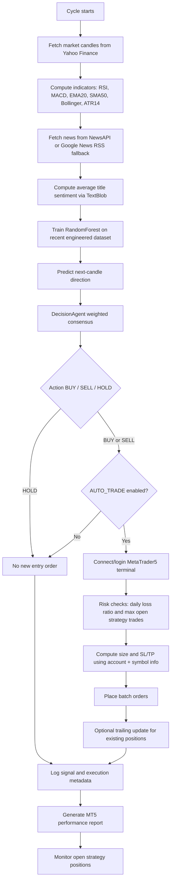
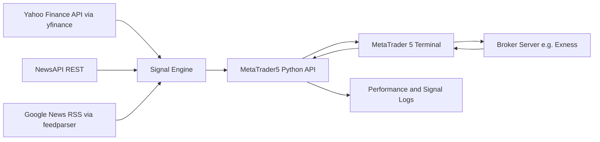

# Agentic Trader - Trading Logic and System Decision Framework

Date: 2026-06-03
Scope: This document summarizes the implemented logic in this repository as currently coded, including strategy composition, entry and exit conditions, risk controls, signal validity checks, HOLD behavior, data and API flow, and a file-by-file breakdown.

## 1. System Objective

The bot performs an hourly signal-generation and execution cycle (or continuous loop), combining:

- Market structure signals (Breakout, ICT-style sweep + BOS, Smart Money proxy)
- Technical indicator confirmation (MACD and trend filter via SMA)
- Quant model directional prediction (Random Forest)
- News sentiment score
- Risk filters (daily loss cap, max open trades, dynamic position sizing)
- Optional trailing management for open positions

The strategy outputs one of three actions:

- BUY
- SELL
- HOLD

Only BUY/SELL can trigger order execution when auto trading is enabled and risk checks pass.

## 2. End-to-End Decision and Execution Flow

## 3. Strategy Components and How They Are Combined

### 3.1 Component signals (each mapped to bullish +1, bearish -1, neutral 0)

1. Breakout signal
- Lookback window: 20 candles (excluding latest)
- BUY bias (+1): latest close breaks above prior 20-candle high
- SELL bias (-1): latest close breaks below prior 20-candle low
- Otherwise 0

2. ICT-style signal (simplified)
- Uses recent swing high/low from candles -12 to -2
- Bullish condition (+1):
  - liquidity sweep below swing low (latest low < swing low), and
  - close reclaims above swing low, and
  - bullish BOS (latest close > previous candle high)
- Bearish condition (-1): mirrored logic at swing high with bearish BOS
- Otherwise 0

3. MACD signal
- +1 if MACD > MACD signal
- -1 if MACD < MACD signal
- 0 if equal

4. Smart Money proxy signal
- Bullish FVG proxy if candle[-3] high < candle[-1] low
- Bearish FVG proxy if candle[-3] low > candle[-1] high
- Requires displacement: latest body > 1.5 * average body over prior 20 candles
- Requires volume spike: latest volume > 1.2 * mean prior 20-candle volume
- If bullish FVG + displacement + volume spike => +1
- If bearish FVG + displacement + volume spike => -1
- Else 0

5. Quant signal
- RandomForest predicts target where target = next close > current close
- prediction 1 => +1
- prediction 0 => -1

6. Sentiment signal
- Average TextBlob polarity of article titles
- +1 if sentiment > 0.05
- -1 if sentiment < -0.05
- 0 otherwise

### 3.2 Weighting model

Weighted consensus score:

score = 0.34*breakout + 0.18*ict + 0.14*macd + 0.24*smart_money + 0.07*quant + 0.03*sentiment

Interpretation:
- Breakout and smart_money are highest impact drivers.
- Quant and sentiment are light modifiers, not primary drivers.

## 4. Entry Classification (True/False Validity for Trade)

A signal is considered valid for entry only if action resolves to BUY or SELL and risk/execution gates pass.

### 4.1 BUY classification logic

BUY is True when all conditions hold:

1. weighted_score >= 0.04
2. RSI < 72 (overbought filter not violated)
3. Trend/structure confirmation:
- trend_ok_buy is True (Close >= SMA50)
  OR
- bullish_structure is True (any of breakout, ict, smart_money is bullish)

Otherwise BUY is False.

### 4.2 SELL classification logic

SELL is True when all conditions hold:

1. weighted_score <= -0.04
2. RSI > 28 (oversold filter not violated)
3. Trend/structure confirmation:
- trend_ok_sell is True (Close <= SMA50)
  OR
- bearish_structure is True (any of breakout, ict, smart_money is bearish)

Otherwise SELL is False.

### 4.3 HOLD classification logic

HOLD is selected (True) when BUY and SELL conditions are not satisfied.
Typical reasons:

- Weighted score in neutral zone (-0.04 < score < 0.04)
- Trend/structure mismatch
- RSI filter blocks the directional setup

### 4.4 Trade validity matrix (operational)

- Decision action BUY/SELL + AUTO_TRADE=False => Signal valid analytically, not executed
- Decision action BUY/SELL + AUTO_TRADE=True + risk_allowed=False => Signal valid analytically, blocked by risk
- Decision action BUY/SELL + AUTO_TRADE=True + risk_allowed=True + MT5 order success => Executed trade
- Decision action HOLD => No entry execution by design

## 5. Entry and Exit Conditions in Practice

## 5.1 Entry order trigger

Entry order is attempted only when:

1. AUTO_TRADE is True
2. action in {BUY, SELL}
3. MT5 initialize + login succeeds
4. Account info is available
5. Daily loss ratio is below max daily loss threshold
6. Open strategy positions for configured magic number are below max open trades

## 5.2 Initial protective exits (at order creation)

Every BUY/SELL order is created with:

- Stop loss (SL) in points
- Take profit (TP) in points

Base defaults from configuration:
- STOP_LOSS_POINTS default 300
- TAKE_PROFIT_POINTS default 600

Hold trades mode adjustment:
- If HOLD_TRADES_MODE=True, SL and TP are expanded using ATR:
  - effective SL = max(base SL, ATR_points * 3)
  - effective TP = max(base TP, ATR_points * 8)

This makes exits volatility-adaptive and generally wider, designed to hold positions through noise.

## 5.3 Dynamic trailing management (post-entry)

If trailing is enabled:

- For qualifying open positions (matching magic number and older than MIN_HOLD_MINUTES):
  - BUY:
    - new SL = bid - trailing_stop_points*point
    - new TP = ask + trailing_tp_points*point
    - update only if it improves position protection/target (higher SL or higher TP)
  - SELL:
    - new SL = ask + trailing_stop_points*point
    - new TP = bid - trailing_tp_points*point
    - update only if it improves protection/target (lower SL or lower TP)

Result: exits are tightened/extended in favorable direction while avoiding adverse widening.

## 6. Risk Management Framework

### 6.1 Position sizing

Risk-based lot size formula:

position_size = (balance * risk_per_trade) / (SL_points * value_per_point_per_lot)

Then:

- Snap to broker lot step
- Clamp to broker min/max lot
- Round to 2 decimals

The strategy calculates symbol-specific value per point per lot from MT5 symbol metadata.

### 6.2 Daily drawdown guard

- Realized PnL for current day is aggregated from closed deals only
- Loss ratio uses losses-only portion:
  - daily_loss_ratio = abs(min(0, day_realized_pnl)) / balance
- Trading blocked when daily_loss_ratio >= MAX_DAILY_LOSS

### 6.3 Exposure cap

- Open strategy trades are filtered by magic number
- Trading blocked when count >= MAX_OPEN_TRADES

### 6.4 Combined risk gate

Final risk_allowed is True only if all checks pass:

- account readable
- daily loss under threshold
- open trades under cap
- valid symbol/account metadata for sizing

## 7. HOLD Function Behavior

HOLD is not a passive error state; it is an explicit action class.

When HOLD occurs:

- No new entry order is placed
- Signal is still logged with confidence, scores, risk state, and metadata
- Existing open positions can still be monitored
- Trailing management can still run for open positions (depending on path and settings)

Practical purpose:

- Prevent low-quality entries during weak consensus or conflicting structure
- Preserve capital and reduce churn when edge is unclear
- Keep market observation active without forcing trades

## 8. News and External Information Integration

### 8.1 News ingestion priority

1. Primary source: NewsAPI /v2/everything endpoint (if API key configured)
2. Fallback source: Google News RSS search feed via feedparser

Query theme:
- gold OR bitcoin OR federal reserve

### 8.2 Sentiment transformation

- Uses TextBlob polarity on article titles
- Average polarity converted into ternary signal: bullish, bearish, neutral
- Sentiment weight in final decision is small (3%), acting as contextual nudge

### 8.3 Other information sources used by the system

1. Market price candles
- Source in strategy engine: Yahoo Finance (yfinance)
- Resolution: 30 days, 1-hour candles
- Used for indicators, structure logic, and quant training

2. Broker/trading platform state
- Source: MetaTrader5 Python API
- Provides account info, symbol metadata, current positions, deal history, order execution

3. Broker relationship (Exness example)
- The code does not call a direct Exness REST API.
- Broker connectivity is mediated through MT5 login credentials/server.
- If Exness is the account provider, it is accessed via MT5 terminal/server routing.

### 8.4 Platform cooperation model

- Yahoo Finance supplies analysis candles.
- NewsAPI/RSS supplies macro/news context.
- Local strategy computes decision from both technical and contextual signals.
- MT5 executes and manages orders at broker level (for example Exness account via MT5 server).
- MT5 history feeds performance analytics back into the local reporting pipeline.

## 9. API and Platform Flow Breakdown

Notes:
- Market analysis and execution are split across providers.
- Execution quality and permissions depend on MT5 terminal state and broker permissions (for example AutoTrading toggle, account auth).

## 10. Indicators Used and Their Roles

1. RSI
- Overbought/oversold filter for trade direction gating

2. MACD and MACD signal
- Directional momentum component in weighted score

3. EMA 20
- Feature in quant model (shorter trend/momentum context)

4. SMA 50
- Trend filter in decision gate (close relative to SMA50)

5. Bollinger Bands
- Computed and available, currently not directly used in decision score

6. ATR 14
- Volatility metric for dynamic SL/TP expansion in hold mode

7. Price/volume derived structure checks
- Breakout levels, liquidity sweep, BOS, FVG proxy, displacement, volume spike

## 11. Model Monitoring and Strategy Validity Checks

The strategy validity is monitored through:

- Logged consensus components per cycle
- Model accuracy snapshot per cycle
- Execution outcome fields (trade_retcode, trade_error)
- Risk flags (risk_allowed, daily_loss_ratio)
- MT5 report statistics (win rate, expectancy, drawdown)

A strategy setup is treated as operationally valid only when:

- Directional classification passes thresholds and filters
- Risk gates permit trade
- Execution environment is healthy (MT5 connection, account auth, symbol readiness)

## 12. Known Operational Guardrails and Failure Modes

Typical blocked or failed states observed in logs:

- Authorization failed in MT5 login
- AutoTrading disabled in MT5 client terminal
- Symbol not found / not visible
- Risk cap reached: max open trades

These do not alter signal generation logic, but they prevent execution.

## 13. Repository File-by-File Breakdown (No secrets)

Root level:

- docker-compose.yml
  - Defines containerized service mapping port 8000 and mounting project volume.

- README.md
  - Currently empty placeholder.

- requirements.txt
  - Python dependencies for API, trading logic, indicators, ML, NLP, and integrations.

- m.txt
  - Plain note describing requested strategy behavior and risk wiring intent.

- data/performance_report.json
  - Generated performance summary from MT5 deal history (wins/losses/PnL/drawdown).

- data/signal_log.csv
  - Time-series audit log of decisions, indicators, risk metadata, and execution outcomes.

Application package:

- app/config.py
  - Loads environment variables and runtime configuration flags for strategy, execution, and risk.

- app/main.py
  - Main orchestration loop: data fetch, indicators, news, model train/predict, decision, risk gate, execution, logging, reporting, and monitoring.

- app/api/routes.py
  - FastAPI router exposing a basic health/home endpoint.

- app/database/db.py
  - Placeholder file (currently empty).

Trading modules:

- app/trading/market_data.py
  - Pulls gold/bitcoin OHLCV candles from Yahoo Finance and normalizes columns.

- app/trading/indicators.py
  - Adds RSI, MACD, EMA20, SMA50, Bollinger bands, and ATR14 to market dataframe.

- app/trading/decision_agent.py
  - Implements multi-strategy signal generation, weighted consensus scoring, filters, confidence/risk labeling, and reasoning output.

- app/trading/quant_model.py
  - Trains RandomForest next-candle direction model and produces latest prediction.

- app/trading/news_agent.py
  - Fetches finance-related news (NewsAPI with RSS fallback) and computes sentiment score.

- app/trading/risk_manager.py
  - Calculates position size, daily-loss ratio, and trade-eligibility checks.

- app/trading/executor.py
  - MT5 connection handling, order placement for BUY/SELL, and trailing SL/TP updates.

- app/trading/performance.py
  - Logs signal records and builds MT5-based performance report from deal history.

- app/trading/memory.py
  - In-memory recent-trade store helper (simple list-based memory object).

Models directory:

- models/
  - Reserved for model artifacts; no file-level logic shown in current tree listing.

## 14. Summary of Current Strategy Character

- Primary edge source: market-structure and breakout style logic, reinforced by trend and momentum checks.
- Secondary context: quant prediction and lightweight sentiment overlay.
- Execution discipline: strong risk gate before order send; volatility-adaptive targets in hold mode; optional trailing management.
- HOLD behavior: explicit capital-preservation mode when consensus quality or filters are insufficient.

This summary reflects the repository implementation as of the date above.
